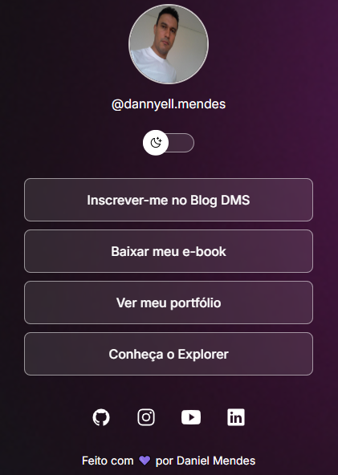

# 📄 Projeto Blog Pessoal | Daniel Mendes

## 👋 Bem-vindo(a) ao Repositório!

Este projeto é o resultado do meu aprendizado em desenvolvimento web, focado em demonstrar minhas qualificações, experiências e habilidades adquiridas no curso de Front-End.

### 💡 Propósito do Projeto
Este Blog foi desenvolvido com o intuito de servir como um **modelo base** que pode ser facilmente adaptado e personalizado por outros utilizadores. O design é focado na acessibilidade e na apresentação clara das informações, permitindo que qualquer um ajuste de acordo com suas próprias habilidades e experiências.



---

## 🚀 Acessar o Blog

Você pode visualizar a versão online e interativa do blog através deste link:

[**Acessar Blog Daniel Mendes**](https://danielmsilva07.github.io)

---

## 🎯 Objetivo do Projeto

Demonstrar minhas competências em desenvolvimento web (**HTML**, **CSS**, e **JavaScript**) através da criação do meu blog digital, servindo também como um portfólio de código.

---

## ✨ Funcionalidades Principais

* **Design Responsivo:** O blog adapta-se perfeitamente a diferentes tamanhos de tela (desktop, tablet, celular).
* **Navegação Intuitiva:** Facilidade em encontrar informações sobre projetos, portfólio, e-book e mídias.

---

## 🛠️ Stack de Desenvolvimento

### Tecnologias Utilizadas (Front-end)

* **HTML5:** Linguagem de marcação utilizada para estruturar o conteúdo do blog.
* **CSS3:** Linguagem de estilo utilizada para estilizar e dar o layout responsivo.
* **JavaScript:** Utilizado para adicionar interatividade e dinamismo à página.

### 💻 Ferramentas de Desenvolvimento

* **Visual Studio Code (VS Code):** Editor de código utilizado para o desenvolvimento.
* **Git:** Sistema de controle de versão.
* **GitHub:** Plataforma de hospedagem do código e colaboração.

---

## ⚙️ Instalação e Uso Local (Para Desenvolvedores)

Se quiser clonar este projeto e rodar localmente em sua máquina, siga os passos abaixo:

1.  **Clone o repositório:**
    ```bash
    git clone [https://github.com/danielmsilva07/danielmsilva07.github.io.git](https://github.com/danielmsilva07/danielmsilva07.github.io.git)
    ```

2.  **Navegue até o diretório do projeto:**
    ```bash
    cd danielmsilva07.github.io
    ```

3.  **Execute:** Abra o arquivo `index.html` em seu navegador de preferência.
---
Quando os arquivos forem clonados e instalados na máquina (computador) poderá utilizar o diretório que for mais conveniente para o projeto. Apresenta-se como sugestão o seguinte caminho: "c:/projetos", utilizando a organização de pastas e subpastas, mas podendo adaptar essa estrutura conforme a necessidade.

---

## ✉️ Contato

Estou aberto(a) a novas oportunidades e colaborações. Sinta-se à vontade para entrar em contato:

* **LinkedIn:** [Daniel Mendes](https://linkedin.com/in/dannyellmendes)
* **Email:** danielmsilva07@gmail.com
* **GitHub:** [danielmsilva07](https://github.com/danielmsilva07)

---

## 📜 Licença

Este projeto está licenciado sob a **[MIT License](LICENSE)** - veja o arquivo [LICENSE](LICENSE) para detalhes.

---
Desenvolvido por Daniel Mendes.